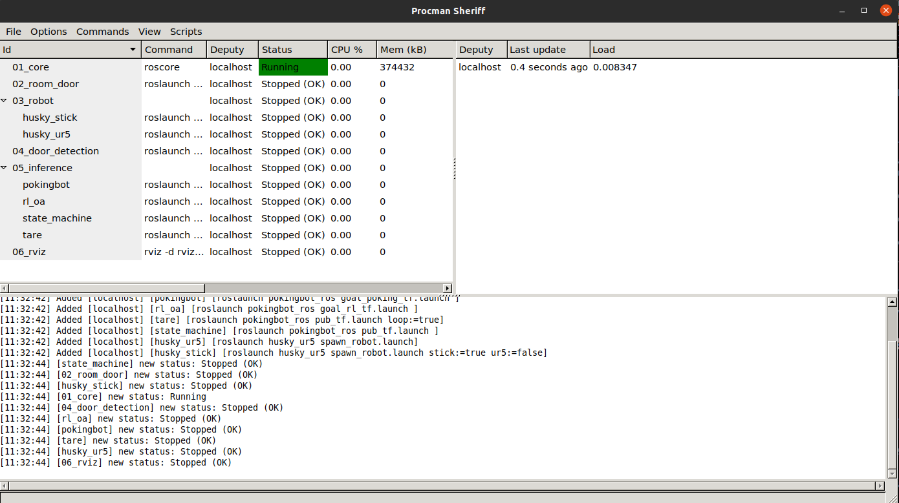
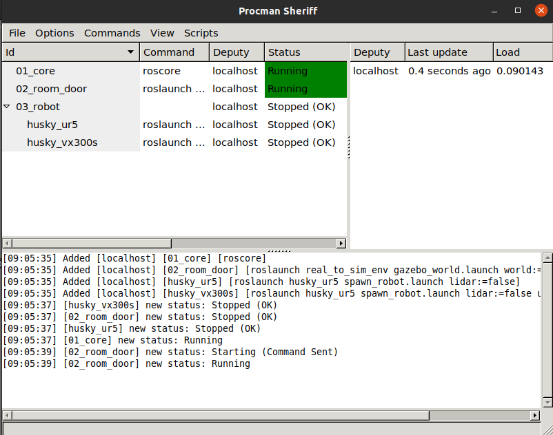
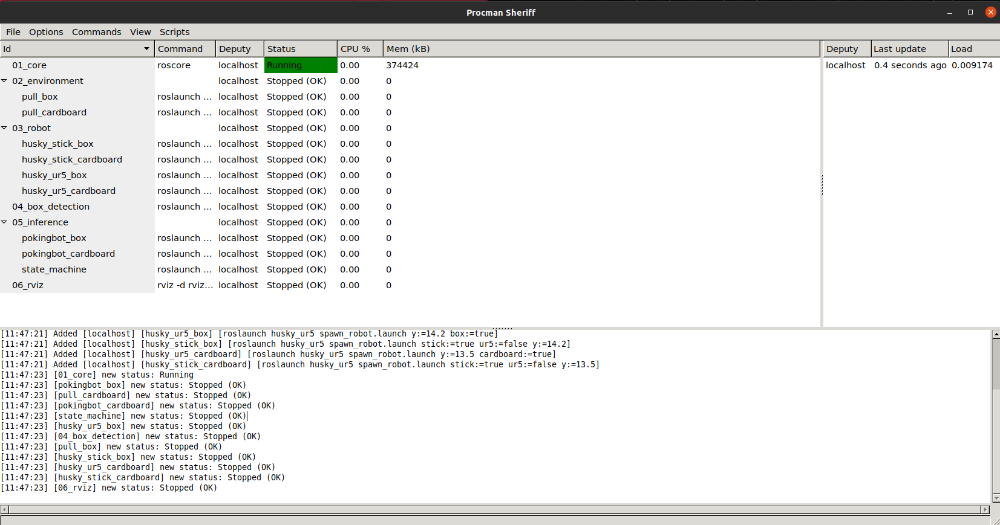
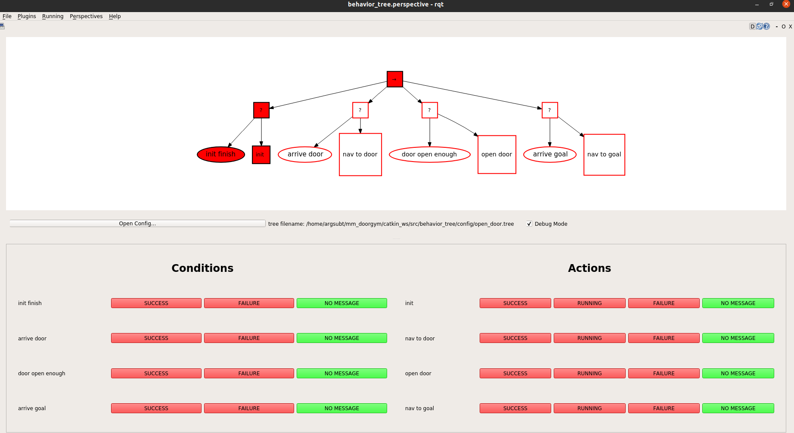

# mm_doorgym

Deep Reinforcement Learning-based Mobile Manipulator Controls for Interactive Navigation through Doors in Hardware in the Loop Simulation and Real World Environments

## Clone repo 

```
git clone --recursive git@github.com:ARG-NCTU/mm_doorgym.git
``` 

## Set up the Docker 

The all required environment was organized, only need laptop or computer with GPU, and make sure install docker already.

### How to use

We released docker images that can use on different workstaion.

1. Docker Run

    Run this script to pull docker image to your workstation.

    ```
    source docker_run.sh
    ```

2. Docker Join

    If want to enter same docker image, type below command.

    ```
    source docker_join.sh
    ```

3. Catkin_make

    Execute the compile script at first time, then the other can ignore this step. 

    ```
    source catkin_make.sh
    ```

4. Setup environment

    Make sure run this command when the terminal enter docker. 

    ```
    source environment.sh
    ```

## Experiment1

We arranged all command in procman, easy to inference our proposed method and Run other baseline.

### Step1. Open procman window
```
source docker_run.sh
source catkin_make.sh
source environment.sh
source start_ex1.sh
```
After open procman, you will see below window.


The useful command for procman list below.
- Run(ctrl＋s)
- Stop(ctrl＋t)
- ReRun(ctrl+r)

### Step2. Inference

* RL_oa

    Following it order to run command, 03_robot select **husky_ur5** and 05_inference chose **rl_oa**.

* TARE

    Open one terminal to run tare algorithm.

    ```
    cd [path/to/autonomous_exploration_development_environment]
    source docker_run.sh
    catkin_make
    source environment.sh
    roslaunch vehicle_simulator husky_tare.launch opened:=false normal:=false ignored:=true
    ```

    Following it order to run command, 03_robot select **husky_ur5**, 05_inference chose **tare**.
    
* Pokingbot

    Following it order to run command, 03_robot select **husky_stick** and 05_inference chose **pokingbot**.

* DoorGym

    Following it order to run command, 03_robot select **husky_ur5** and 05_inference chose **state_machine**.

* RL_mm(Ours)

    Following it order to run command, 03_robot select **husky_ur5** and 05_inference chose **state_machine**.

Then open two termianl, one is run open_door algorithm, and the other one is open tare to navigate door and goal.

1. One terminal for tare

    ```
    cd [path/to/autonomous_exploration_development_environment]
    source docker_run.sh
    catkin_make
    source environment.sh
    roslaunch vehicle_simulator husky_tare.launch opened:=true normal:=false ignored:=false
    ```
2. Second terminal for dooropen

    * For the DoorGym

        ```
        cd [path/to/DoorGym]
        source docker_run.sh
        source catkin_make.sh
        source environment.sh
        python3 download.py
        roslaunch doorgym door_open.launch state:=true method:=DoorGym
        ```

    * For thr RL_mm

        ```
        cd [path/to/DoorGym]
        source docker_run.sh
        source catkin_make.sh
        source environment.sh
        python3 download.py
        roslaunch doorgym door_open.launch state:=true method:=RL_mm
        ```

## Experiment2

We arranged all command in procman, easy to inference our proposed method and Run other baseline.

### Step1. Open procman window
```
source docker_run.sh
source catkin_make.sh
source environment.sh
source start_ex2.sh
```
After open procman, you will see below window.


The useful command for procman list below.
- Run(ctrl＋s)
- Stop(ctrl＋t)
- ReRun(ctrl+r)

### Step2. Inference

* UR5

    Following it order to run command, 03_robot select **husky_ur5**.

    Open one terminal to run door open.

    - For 6 joints
        ```
        cd [path/to/DoorGym]
        source docker_run.sh
        source catkin_make.sh
        source environment.sh
        roslaunch doorgym door_open.launch state:=false ur5:=true dof:=false times:=10
        ```
    - For 3 DOF
        ```
        cd [path/to/DoorGym]
        source docker_run.sh
        source catkin_make.sh
        source environment.sh
        roslaunch doorgym door_open.launch state:=false ur5:=true dof:=true times:=10
        ```

* VX300s

    Following it order to run command, 03_robot select **husky_vx300s**.

    Open one terminal to run door open.

    - For 6 joints
        ```
        cd [path/to/DoorGym]
        source docker_run.sh
        source catkin_make.sh
        source environment.sh
        roslaunch doorgym door_open.launch state:=false ur5:=false dof:=false times:=10
        ```
    - For 3 DOF
        ```
        cd [path/to/DoorGym]
        source docker_run.sh
        source catkin_make.sh
        source environment.sh
        roslaunch doorgym door_open.launch state:=false ur5:=false dof:=true times:=10
        ```

## Experiment3

We arranged all command in procman, easy to inference our proposed method and Run other baseline.

### Step1. Open procman window
```
source docker_run.sh
source catkin_make.sh
source environment.sh
source start_ex3.sh
```
After open procman, you will see below window.


The useful command for procman list below.
- Run(ctrl＋s)
- Stop(ctrl＋t)
- ReRun(ctrl+r)

### Step2. Inference 

* Box

    - Pokingbot

        Following it order to run command, 02_environment select **pull_box**, 03_robot select **husky_stick_box**, 05_inference select **pokingbot_box**.

    - DoorGym

        Following it order to run command, 02_environment select **pull_box**, 03_robot select **husky_ur5_box**, 05_inference select **state_machine**.

        Open two terminals to run tare algorithm and pull model.

        1. One terminal for tare

            ```
            cd [path/to/autonomous_exploration_development_environment]
            source docker_run.sh
            catkin_make
            source environment.sh
            roslaunch vehicle_simulator husky_tare.launch opened:=false normal:=true ignored:=false
            ```

        2. Two terminal for DoorGym

            ```
            cd [path/to/DoorGym]
            source docker_run.sh
            source catkin_make.sh
            source environment.sh
            roslaunch doorgym pull_box.launch method:=Doorgym box:=true
            ```

    - 6 joints

        Change two terminal command.

        ```
        cd [path/to/DoorGym]
        source docker_run.sh
        source catkin_make.sh
        source environment.sh
        roslaunch doorgym pull_box.launch method:=6joints box:=true
        ```

    - 3 DOF

        Change two terminal command.

        ```
        cd [path/to/DoorGym]
        source docker_run.sh
        source catkin_make.sh
        source environment.sh
        roslaunch doorgym pull_box.launch method:=RL_mm box:=true
        ```


* Cardboard

    The all steps are same as box, before you execute it, 02_environment select **pull_cardboard**.

    - For the Pokingbot

        The 03_robot select **husky_stick_cardboard**, 05_inference select **pokingbot_cardboard**.

    - For the other

        The 03_robot select **husky_ur5_cardboard**, 05_inference select **state_machine**.

        * For DoorGym

            ```
            roslaunch doorgym pull_box.launch method:=Doorgym box:=false
            ```

        * For 6joints

            ```
            roslaunch doorgym pull_box.launch method:=6joints box:=false
            ```

        * For 3DOF

            ```
            roslaunch doorgym pull_box.launch method:=RL_mm box:=false
            ```

## Behavior Tree

Apart from the smach, I also use behavior tree to infer this task, below example for husky ur5 3 dof push task.

```
source docker_run.sh
source catkin_make.sh
source environment.sh
source start_ex1.sh
```
After open procman, you will see below window.


The useful command for procman list below.
- Run(ctrl＋s)
- Stop(ctrl＋t)
- ReRun(ctrl+r)

Following it order to run command, 03_robot select **husky_ur5** and 06_inference chose **state_machine**.

Open one terminal to open behavior tree.

```
source docker_join.sh
source environment.sh
roslaunch behavior_tree behavior_tree.launch
```

you will see below gui, then press "Open Config..." and select open_door.tree, select Debug Mode will show below test button.


Then open two termianl, one is run open_door algorithm, and the other one is open tare to navigate door and goal.

1. One terminal for tare

    ```
    cd [path/to/autonomous_exploration_development_environment]
    source docker_run.sh
    catkin_make
    source environment.sh
    roslaunch vehicle_simulator husky_tare.launch opened:=true normal:=false ignored:=false
    ```
2. Second terminal for door open

    ```
    cd [path/to/DoorGym]
    source docker_run.sh
    source catkin_make.sh
    source environment.sh
    roslaunch doorgym door_open_bt.launch
    ```

Finished above commands, you will see robot automatically run in the gazebo.
