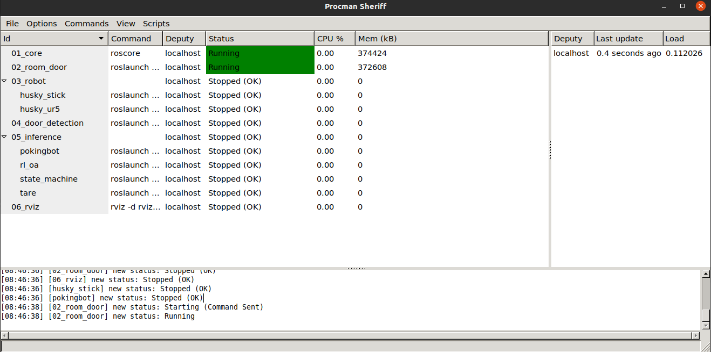

# mm_doorgym

Deep Reinforcement Learning-based Mobile Manipulator Controls for Interactive Navigation through Doors in Hardware in the Loop Simulation and Real World Environments

## Clone repo 

```
git clone --recursive git@github.com:ARG-NCTU/mm_doorgym.git
``` 

## Set up the Docker 

The all required environment was organized, only need laptop or computer with GPU, and make sure install docker already.

### How to use

We released docker images that can use on different workstaion.

1. Docker Run

    Run this script to pull docker image to your workstation.

    ```
    source docker_run.sh
    ```

2. Docker Join

    If want to enter same docker image, type below command.

    ```
    source docker_join.sh
    ```

3. Catkin_make

    Execute the compile script at first time, then the other can ignore this step. 

    ```
    source catkin_make.sh
    ```

4. Setup environment

    Make sure run this command when the terminal enter docker. 

    ```
    source environment.sh
    ```

## Experiment1

We arranged all command in procman, easy to inference our proposed method and Run other baseline.

### Step1. Open procman window
```
source docker_run.sh
source catkin_make.sh
source environment.sh
source start_ex1.sh
```
After open procman, you will see below window.


The useful command for procman list below.
- Run(ctrl＋s)
- Stop(ctrl＋t)
- ReRun(ctrl+r)

### Step2. Inference

* RL_oa

    Following the below steps to execute

    1. 03_robot select **husky_ur5** 
    2. 04_door_detection
    3. 05_inference select **rl_oa**
    4. 06_rviz

    The experiment result and its trajectories will stored [Results](./Results/) folder.

* TARE

    Following the below steps to execute

    1. Open one terminal to run tare algorithm.

        ```
        cd [path/to/autonomous_exploration_development_environment]
        source docker_run.sh
        catkin_make
        source environment.sh
        roslaunch vehicle_simulator husky_tare.launch opened:=false normal:=false ignored:=true
        ```

    2. 03_robot select **husky_ur5** 
    3. 04_door_detection
    4. 05_inference select **tare**
    5. 06_rviz

    The experiment result and its trajectories will stored [Results](./Results/) folder.
    
* Pokingbot

    Following the below steps to execute

    1. 03_robot select **husky_stick** 
    2. 04_door_detection
    3. 05_inference select **pokingbot**
    4. 06_rviz

    The experiment result and its trajectories will stored [Results](./Results/) folder.

* DoorGym

    Following the below steps to execute

    1. Open one terminal to run tare algorithm

        ```
        cd [path/to/autonomous_exploration_development_environment]
        source docker_run.sh
        catkin_make
        source environment.sh
        roslaunch vehicle_simulator husky_tare.launch opened:=true normal:=false ignored:=false
        ```

    2. 03_robot select **husky_ur5** 
    3. 04_door_detection
    4. 05_inference select **state_machine**
    5. 06_rviz

    6. Open another terminal to run door open

        ```
        cd [path/to/DoorGym]
        source docker_run.sh
        source catkin_make.sh
        source environment.sh
        roslaunch doorgym door_open.launch state:=true method:=DoorGym
        ```

    The experiment result and its trajectories will stored [Results](https://github.com/ARG-NCTU/DoorGym/tree/master/Results) folder at [DoorGym](https://github.com/ARG-NCTU/DoorGym) repo.

* RL_mm(Ours)

    Following the below steps to execute

    1. Open one terminal to run tare algorithm

        ```
        cd [path/to/autonomous_exploration_development_environment]
        source docker_run.sh
        catkin_make
        source environment.sh
        roslaunch vehicle_simulator husky_tare.launch opened:=true normal:=false ignored:=false
        ```

    2. 03_robot select **husky_ur5** 
    3. 04_door_detection
    4. 05_inference select **state_machine**
    5. 06_rviz

    6. Open two terminal to run door open

        ```
        cd [path/to/DoorGym]
        source docker_run.sh
        source catkin_make.sh
        source environment.sh
        roslaunch doorgym door_open.launch state:=true method:=RL_mm
        ```

    The experiment result and its trajectories will stored [Results](https://github.com/ARG-NCTU/DoorGym/tree/master/Results) folder at [DoorGym](https://github.com/ARG-NCTU/DoorGym) repo.

## Experiment

We arranged all command in procman, easy to inference our proposed method and Run other baseline.

### Step1. Open procman window
```
source docker_run.sh
source catkin_make.sh
source environment.sh
source start_ex2.sh
```
After open procman, you will see below window.


The useful command for procman list below.
- Run(ctrl＋s)
- Stop(ctrl＋t)
- ReRun(ctrl+r)

### Step2. Inference

* UR5

    Following the below steps to execute

    1. 03_robot select **husky_ur5**.
    2. Open one terminal to run door open.

        - For 6 joints
            ```
            cd [path/to/DoorGym]
            source docker_run.sh
            source catkin_make.sh
            source environment.sh
            roslaunch doorgym door_open.launch state:=false ur5:=true dof:=false yaml:=goal_ex2.yaml
            ```
        - For 3 DOF
            ```
            cd [path/to/DoorGym]
            source docker_run.sh
            source catkin_make.sh
            source environment.sh
            roslaunch doorgym door_open.launch state:=false ur5:=true dof:=true yaml:=goal_ex2.yaml
            ```

        The experiment result and its trajectories will stored [Results](https://github.com/ARG-NCTU/DoorGym/tree/master/Results) folder at [DoorGym](https://github.com/ARG-NCTU/DoorGym) repo.

* VX300s

    Following the below steps to execute

    1. 03_robot select **husky_vx300s**.
    2. Open one terminal to run door open.

        - For 6 joints
            ```
            cd [path/to/DoorGym]
            source docker_run.sh
            source catkin_make.sh
            source environment.sh
            roslaunch doorgym door_open.launch state:=false ur5:=false dof:=false yaml:=goal_ex2.yaml
            ```
        - For 3 DOF
            ```
            cd [path/to/DoorGym]
            source docker_run.sh
            source catkin_make.sh
            source environment.sh
            roslaunch doorgym door_open.launch state:=false ur5:=false dof:=true yaml:=goal_ex2.yaml
            ```

        The experiment result and its trajectories will stored [Results](https://github.com/ARG-NCTU/DoorGym/tree/master/Results) folder at [DoorGym](https://github.com/ARG-NCTU/DoorGym) repo.

## Experiment3

We arranged all command in procman, easy to inference our proposed method and Run other baseline.

### Step1. Open procman window
```
source docker_run.sh
source catkin_make.sh
source environment.sh
source start_ex3.sh
```
After open procman, you will see below window.


The useful command for procman list below.
- Run(ctrl＋s)
- Stop(ctrl＋t)
- ReRun(ctrl+r)

### Step2. Inference 

* Box

    - Pokingbot

        Following the below steps to execute

        1. 02_environment select **pull_box**
        2. 03_robot select **husky_stick_box** 
        3. 04_box_detection
        4. 05_inference select **pokingbot_box**
        5. 06_rviz

        The experiment result and its trajectories will stored [Results](./Results/) folder.

    - DoorGym

        Following the below steps to execute

        1. 02_environment select **pull_box**
        2. 03_robot select **husky_ur5_box** 
        3. 04_box_detection
        4. 05_inference select **state_machine**
        5. 06_rviz

        6. Open one terminal to run tare algorithm

            ```
            cd [path/to/autonomous_exploration_development_environment]
            source docker_run.sh
            catkin_make
            source environment.sh
            roslaunch vehicle_simulator husky_tare.launch opened:=false normal:=true ignored:=false
            ```

        7. Open two terminal to run pull

            ```
            cd [path/to/DoorGym]
            source docker_run.sh
            source catkin_make.sh
            source environment.sh
            roslaunch doorgym pull_box.launch method:=DoorGym box:=true
            ```

        The experiment result and its trajectories will stored [Results](https://github.com/ARG-NCTU/DoorGym/tree/master/Results) folder at [DoorGym](https://github.com/ARG-NCTU/DoorGym) repo.

    - 6 joints

        Following the below steps to execute

        1. 02_environment select **pull_box**
        2. 03_robot select **husky_ur5_box** 
        3. 04_box_detection
        4. 05_inference select **state_machine**
        5. 06_rviz

        6. Open one terminal to run tare algorithm

            ```
            cd [path/to/autonomous_exploration_development_environment]
            source docker_run.sh
            catkin_make
            source environment.sh
            roslaunch vehicle_simulator husky_tare.launch opened:=false normal:=true ignored:=false
            ```

        7. Open two terminal to run pull

            ```
            cd [path/to/DoorGym]
            source docker_run.sh
            source catkin_make.sh
            source environment.sh
            roslaunch doorgym pull_box.launch method:=6joints box:=true
            ```

        The experiment result and its trajectories will stored [Results](https://github.com/ARG-NCTU/DoorGym/tree/master/Results) folder at [DoorGym](https://github.com/ARG-NCTU/DoorGym) repo.
            
    - 3 DOF

        Following the below steps to execute

        1. 02_environment select **pull_box**
        2. 03_robot select **husky_ur5_box** 
        3. 04_box_detection
        4. 05_inference select **state_machine**
        5. 06_rviz

        6. Open one terminal to run tare algorithm

            ```
            cd [path/to/autonomous_exploration_development_environment]
            source docker_run.sh
            catkin_make
            source environment.sh
            roslaunch vehicle_simulator husky_tare.launch opened:=false normal:=true ignored:=false
            ```

        7. Open two terminal to run pull

            ```
            cd [path/to/DoorGym]
            source docker_run.sh
            source catkin_make.sh
            source environment.sh
            roslaunch doorgym pull_box.launch method:=RL_mm box:=true
            ```

        The experiment result and its trajectories will stored [Results](https://github.com/ARG-NCTU/DoorGym/tree/master/Results) folder at [DoorGym](https://github.com/ARG-NCTU/DoorGym) repo.

* Cardboard

    - Pokingbot

        Following the below steps to execute

        1. 02_environment select **pull_cardboard**
        2. 03_robot select **husky_stick_cardboard** 
        3. 04_box_detection
        4. 05_inference select **pokingbot_cardboard**
        5. 06_rviz

        The experiment result and its trajectories will stored [Results](./Results/) folder.

    - DoorGym

        Following the below steps to execute

        1. 02_environment select **pull_cardboard**
        2. 03_robot select **husky_ur5_cardboard** 
        3. 04_box_detection
        4. 05_inference select **state_machine**
        5. 06_rviz

        6. Open one terminal to run tare algorithm

            ```
            cd [path/to/autonomous_exploration_development_environment]
            source docker_run.sh
            catkin_make
            source environment.sh
            roslaunch vehicle_simulator husky_tare.launch opened:=false normal:=true ignored:=false
            ```

        7. Open two terminal to run pull

            ```
            cd [path/to/DoorGym]
            source docker_run.sh
            source catkin_make.sh
            source environment.sh
            roslaunch doorgym pull_box.launch method:=DoorGym box:=false yaml:=goal_ex3_cardboard.yaml
            ```

        The experiment result and its trajectories will stored [Results](https://github.com/ARG-NCTU/DoorGym/tree/master/Results) folder at [DoorGym](https://github.com/ARG-NCTU/DoorGym) repo.

    - 6joints

        Following the below steps to execute

        1. 02_environment select **pull_cardboard**
        2. 03_robot select **husky_ur5_cardboard** 
        3. 04_box_detection
        4. 05_inference select **state_machine**
        5. 06_rviz

        6. Open one terminal to run tare algorithm

            ```
            cd [path/to/autonomous_exploration_development_environment]
            source docker_run.sh
            catkin_make
            source environment.sh
            roslaunch vehicle_simulator husky_tare.launch opened:=false normal:=true ignored:=false
            ```

        7. Open two terminal to run pull

            ```
            cd [path/to/DoorGym]
            source docker_run.sh
            source catkin_make.sh
            source environment.sh
            roslaunch doorgym pull_box.launch method:=6joints box:=false yaml:=goal_ex3_cardboard.yaml
            ```

        The experiment result and its trajectories will stored [Results](https://github.com/ARG-NCTU/DoorGym/tree/master/Results) folder at [DoorGym](https://github.com/ARG-NCTU/DoorGym) repo.

    - 3DOF

        Following the below steps to execute

        1. 02_environment select **pull_cardboard**
        2. 03_robot select **husky_ur5_cardboard** 
        3. 04_box_detection
        4. 05_inference select **state_machine**
        5. 06_rviz

        6. Open one terminal to run tare algorithm

            ```
            cd [path/to/autonomous_exploration_development_environment]
            source docker_run.sh
            catkin_make
            source environment.sh
            roslaunch vehicle_simulator husky_tare.launch opened:=false normal:=true ignored:=false
            ```

        7. Open two terminal to run pull

            ```
            cd [path/to/DoorGym]
            source docker_run.sh
            source catkin_make.sh
            source environment.sh
            roslaunch doorgym pull_box.launch method:=RL_mm box:=false yaml:=goal_ex3_cardboard.yaml
            ```

        The experiment result and its trajectories will stored [Results](https://github.com/ARG-NCTU/DoorGym/tree/master/Results) folder at [DoorGym](https://github.com/ARG-NCTU/DoorGym) repo.

## Behavior Tree

Apart from the smach, I also use behavior tree to infer this task, below example for husky ur5 3 dof push task.

```
source docker_run.sh
source catkin_make.sh
source environment.sh
source start_ex1.sh
```
After open procman, you will see below window.


The useful command for procman list below.
- Run(ctrl＋s)
- Stop(ctrl＋t)
- ReRun(ctrl+r)

Following the below steps to execute

1. 03_robot select **husky_ur5**
2. 04_door_detection
3. 05_inference select **state_machine**
4. 06_rviz

5. Open one terminal to open behavior tree.

    ```
    source docker_join.sh
    source environment.sh
    roslaunch behavior_tree behavior_tree.launch tree:=open_door.tree
    ```

you will see below gui, then press "Open Config..." and select open_door.tree, select Debug Mode will show below test button.


6. One terminal for tare

    ```
    cd [path/to/autonomous_exploration_development_environment]
    source docker_run.sh
    catkin_make
    source environment.sh
    roslaunch vehicle_simulator husky_tare.launch opened:=true normal:=false ignored:=false
    ```
7. Open two terminal for door open

    ```
    cd [path/to/DoorGym]
    source docker_run.sh
    source catkin_make.sh
    source environment.sh
    roslaunch doorgym door_open_bt.launch
    ```

3. Third terminal for behavior tree

    ```
    cd [path/to/mm_doorgym]
    source docker_join.sh
    source environment.sh
    roslaunch open_door_bt bt_door_open.launch
    ```

Finished above commands, you will see robot automatically run in the gazebo.
